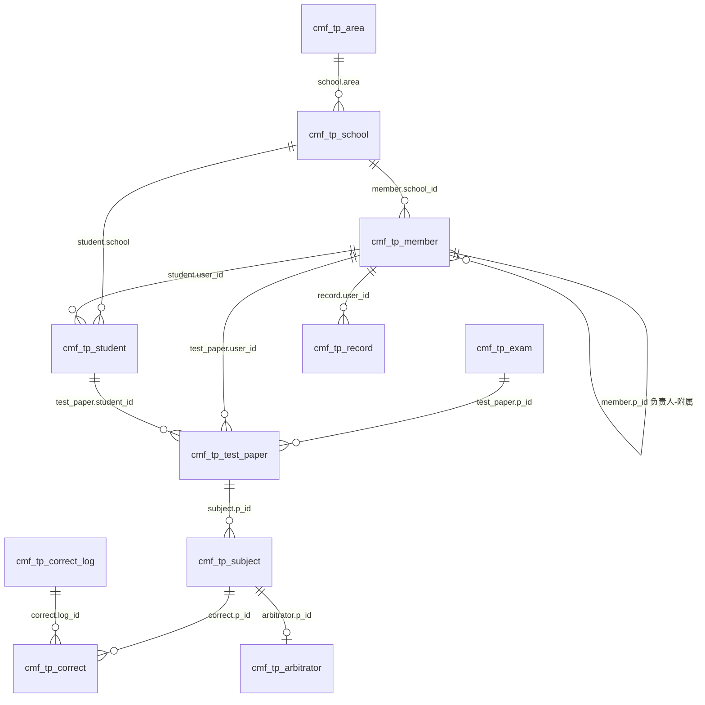

# 旧系统调研报告（完整版）

> 调研对象：CPHOS 联考旧平台（ThinkCMF / MySQL 5.7.34-log，库 `[REDACTED_LEGACY_NAMESPACE]_3` @ [REDACTED_LEGACY_DB_HOST]:3306）
> 信息源：① 服务器管理员提供的业务说明（a–f）；② 对线上库的**只读**探针（仅 SELECT/SHOW/information_schema，抽样 LIMIT 5，敏感字段脱敏，无任何写入、无全量导出）；③ 管理员 AI 整理的《现有数据结构与业务逻辑说明》（其全部关键论断已逐条在库上复核，见 §10）。
> 原始探针结果：`private-legacy-probe/output/01~07c_*.json`；脚本：`private-legacy-probe/dbprobe/*.mjs`（可复跑）。
> 用途：本报告是新系统设计的输入（见《02_新系统设计》），旧平台考试数据不迁移、只继承字典/参照快照/业务规则。

---

## 1. 系统概览

| 项 | 值 |
| --- | --- |
| 框架 | ThinkCMF（ThinkPHP 5 系 CMS），表前缀 `cmf_` |
| 数据库 | MySQL `5.7.34-log`，utf8mb4 / utf8mb4_general_ci，sql_mode 宽松（无严格模式） |
| 表 | 共 47 张：31 张 ThinkCMF 框架表 + 16 张 `cmf_tp_*` 联考业务表 |
| 存储过程/触发器 | 无（业务逻辑全在 PHP 应用层） |
| 管理后台 | `https://[REDACTED_LEGACY_NAMESPACE].[REDACTED_DOMAIN]/admin/public/login.html`（SPA，2 个后台账号） |
| 小程序端 | 教练/学生入口，登录凭据 = 微信 openid |
| 用户表 | **外包独立部署**，其 IP/端口/账号仍未提供（对旧系统是"外接"的用户中心） |

### 1.1 数据规模（只读探针实测，统计时点 2026-08）

| 表 | 现存行数 | AUTO_INCREMENT | 用途 |
| --- | ---: | ---: | --- |
| cmf_tp_area | 35 | 37 | 赛区/特殊组织 |
| cmf_tp_school | 309 | 422 | 学校 |
| cmf_tp_member | 3,064 | 3,545 | 教练/仲裁员/负责人（~481 行已删） |
| cmf_tp_student | 4,484 | 7,952 | 学生（~3,468 行已删） |
| cmf_tp_exam | 26 | 46 | 考试批次（现存 id 17–45；已删 id 8–16、19、36、38） |
| cmf_tp_test_paper | 14,015 | 14,147 | 上传整卷（一次一条） |
| cmf_tp_test_paper_copy | 11,195 | 11,326 | 整卷历史副本 |
| cmf_tp_subject | 138,162 | 138,291 | 每张卷每题的图片与最终分 |
| cmf_tp_correct | 256,612 | **401,926** | 阅卷任务（~14.5 万行被撤销删除） |
| cmf_tp_arbitrator | 14,855 | 15,342 | 仲裁任务 |
| cmf_tp_correct_log | 19 | 20 | 阅卷分配批次（2024 年后启用） |
| cmf_tp_record | 187,976 | 188,029 | 任务实际操作日志（2022-08 起） |
| cmf_tp_set | 1 | 2 | 全局配置（单行） |
| cmf_tp_topic / grade / prize | 10 / 10 / 5 | — | 字典 |
| cmf_user | 2 | 3 | 后台管理员（[REDACTED_ADMIN_USERS]） |
| cmf_asset | ~102,109 | — | 文件元数据（答题卡图片索引） |

时间范围：member 2021-11 → 2026-09；record 2022-08 → 2026-07。

---

## 2. 对象关系（ER）



### 2.1 主关系表（应用层约定，无数据库外键）

| 来源字段 | 逻辑目标 | 业务含义 | 物理索引 |
| --- | --- | --- | --- |
| school.area | area.id | 学校所属赛区（基本按省份 + 特殊组织） | 有 |
| member.school_id | school.id | 成员学校（**varchar 存数字**） | 无 |
| member.p_id | member.id | 附属教练 → 负责人 | 无 |
| student.user_id | member.id | 创建/管理学生的团队账户 | 有 |
| student.school | school.id | 学生学校 | 有 |
| test_paper.p_id / user_id / student_id | exam.id / member.id / student.id | 批次 / 上传团队 / 学生 | 有 |
| subject.p_id | test_paper.id | 单题 → 整卷 | 无 |
| correct.p_id / arbitrator.p_id | subject.id | 阅卷/仲裁任务 → 单题 | 无 |
| correct.log_id | correct_log.id | 任务 → 分配批次 | 无 |
| correct_log.exam_id | exam.id | 分配批次 → 考试 | 无 |
| record.user_id | member.id | **实际操作成员** | 无 |
| record.topic_id | correct.id 或 arbitrator.id | **多态任务 ID**（表内无类型列） | 无 |

### 2.2 命名陷阱（同名字段分层含义不同）

- `p_id` 在 exam/test_paper/subject/correct/arbitrator 各层指向不同父表；
- `record.topic_id` 与 `cmf_tp_topic.id`（题号字典）无关，是阅卷/仲裁任务 ID；
- `member.subject` / `subject.subject` / `correct_log.subject_ids` 中的数值是**上传/阅卷槽位**（1–10），槽位与物理试题的映射由 `set.title` 文本解释（第30届：槽位 1–5=第一~五题，槽位 6/7=第六题两页，槽位 8=第七题）；
- `cmf_tp_set` 是全局单例，没有考试版本。

---

## 3. 通用枚举与状态

| 表字段 | 值 | 含义 |
| --- | ---: | --- |
| member.status | 0 / 1 | 待审核 / 已审核 |
| member.type | 1 / 2 / 3 | 负责人 / 仲裁成员 / 附属教练 |
| exam.status | 1 / 2 / 3 | 已结束 / 正在进行 / **历史存在 3，含义未确认** |
| exam.type | 1 / 2 | 未分配 / 已分配 |
| exam.show | 2 | 展示（仅当前届） |
| correct.status | 1 / 2 | 待批阅 / 已完成 |
| arbitrator.status | 1 / 2 | 待仲裁 / 已完成 |
| subject.status | 1 / 2 | 通常=未完成 / 已有最终成绩（**有 950 行 status=1 但 grade 已填**，不能单独作为最终分存在性依据） |
| correct_log.status | 1 / 2 | 已分配 / 已撤销 |

---

## 4. 用户与组织域（主数据）

### 4.1 `cmf_tp_member` — 教练/用户主体（核心表）

| 字段 | 类型 | 语义（注释 + 实测） |
| --- | --- | --- |
| id | int PK | 成员 ID（团队、上传、阅卷链路的统一账号 ID） |
| p_id | int | 附属教练 → 负责人 id；0=本人即负责人。147 个 p_id>0 且**全部 type=3**；其中 145 人挂 87 名已审核负责人，**2 行 p_id=id 自指异常**（id 1122、1811） |
| openid | varchar | 微信身份标识。3064/3064 有值、**实测 0 重复 0 空**，但数据库**无唯一索引** |
| nickname / avatar | varchar | 微信昵称 / 头像 URL；昵称存在 **52 组重复** |
| user_name | varchar | 真实姓名（审核通过后录入） |
| school_id | varchar | 学校（字符串存数字）；待审核者 NULL；无脏值（CAST 校验 0 悬空） |
| subject | int | 默认批阅/仲裁槽位（1–10），页面称"批阅题号"。分布：1→2279（默认）、2~8→78~103、9→6、10→159 |
| status | int | 审核状态：0 待审核 **1788** / 1 已审核 **1276** |
| type | int | 角色：1 负责人 **2899** / 2 仲裁成员 **18** / 3 附属教练 **147** |
| limit | int | 上传试卷限制，默认 100，API 0–60000；**个人参赛者审核脚本默认 1**（"个人"学校 491 名已审核成员中 415 人为 1） |
| create_time / last_login_time | int(10) | 注册 / 最近登录 |

**审核流程（历史脚本实测）**：小程序访问 → 写入 openid/nickname/avatar，`status=0`；后台按微信昵称检索待审核；人工审核写入 `user_name / school_id / subject / limit` + `status=1`，**不重写 type**（新成员沿用默认 1=负责人）；附属教练随后写 `type=3, p_id=负责人`；仲裁成员写 `type=2, p_id=0`。**角色/槽位切换前置检查**：变更前统计该负责人当前考试的 `correct.status=1` 数，有未完成任务则拒绝。

**个人参赛者**（b2）：归入"个人"地区（21）+ "个人"学校（134），`type=1, p_id=0, subject=1, limit=1`，无下属教练，账号自身承担学生管理与上传。

**CPHO-S 特殊组织**（b6）：根成员 `member.id=41`（姓名 CPHO-S，school 174"组委会"，type=1，p_id=0，subject=10）。"个人→CPHO-S 下属"使个人账户退出阅卷分配（CPHO-S 不接收普通阅卷任务）；"设为负责人"恢复 `type=1,p_id=0` 上传入口。两按钮的具体 SQL 未取得；当前无个人账户挂在 41 名下。

### 4.2 `cmf_tp_student` — 学生主数据（c）

| 字段 | 语义 |
| --- | --- |
| id / user_id | 学生 ID / 归属教练（919 名教练名下 4484 名学生，最多一人 72 名） |
| name | 学生姓名 |
| school / grade / prize | 学校 / **毕业年份字符串**（"2021"~"2030"）/ 奖项**字符串**（字典形同虚设："其他"3140、省级一等奖 862、全国一等奖 270…） |
| create_time | 创建时间 |

无 exam_id；跨考试复用：**1,896 名学生关联多场考试**（最多 12 场），第30届 313 名学生中 196 名参加过其他批次。某学生参加某场考试由 `test_paper(student_id, p_id)` 联合表达。

### 4.3 学校 / 赛区 / 字典

- `cmf_tp_school(id, school_name, area)`：309 行；特殊条目：134"个人"（area 21）、174"组委会"+2/3"组委会-THU/PKU"（area 2）、43/44/45/87"命题组-*"（area 3）、42"测试"、70"观察员"、86"联席会"。
- `cmf_tp_area(id, area)`：35 行 = 31 省份 + 特殊组织（测试组/CPHO-S组委会/CPHO-S命题组/个人/观察员/联席会）。
- 字典：`grade`（2021–2030）、`prize`（5 档）、`topic`（"第一题"~"第十题"）。

### 4.4 后台账号与文件元数据

- `cmf_user`：2 个管理员（[REDACTED_ADMIN_USERS]），ThinkCMF 标准字段，密码 `cmf_password` 哈希（算法未验证）；`cmf_user_token` 会话 token 2 条（无需保留）。
- `cmf_asset`：文件元数据（file_key/md5/sha1/file_path…）。`subject.image` 存相对对象键（如 `[REDACTED_LEGACY_NAMESPACE]/default/20260627/xxx.jpg`），与 `asset.file_path` 字符串精确匹配形成可选关系；第30届 2520 键中 2331 个可匹配。

---

## 5. 考试与阅卷域

### 5.1 `cmf_tp_exam` — 考试批次（d）

现存 26 行（id 17–45）："第6届…"至"第30届 CPHOS 物理竞赛联考"（id 45，status=2 正在进行，show=2，create_time=2026-06-27 14:32:40 UTC+8），中间混入"测试""250306测试"等内部批次。已删除考试：id 8–16、19、36、38（仍被 976 条 test_paper 引用）。每届试卷数：23 届 1403、26 届 1120、20 届 996、28 届 987、40 届 914、第30届 313。

### 5.2 `cmf_tp_test_paper` — 一场考试一名学生一套整卷

`id / p_id→exam / user_id(上传团队负责人) / student_id / score(总分) / eight(槽位1-8理论总分) / two(槽位9-10实验总分) / create_time`

- "一生一卷"无唯一约束（应用约定）；历史有 23 组 `(exam_id,student_id)` 重复整卷（最多 3 行），第30届无重复。
- 第30届 313 套：312 套 `student.user_id = test_paper.user_id`（其中 1 套学生学校与上传者学校不一致：学生[REDACTED_STUDENT_1]挂"个人"学校 134、上传者属学校 413），另 1 套 user_id 也不一致（卷 13904：学生[REDACTED_STUDENT_2]属教练 2846、上传者 149 [REDACTED_UPLOADER]）。
- 汇总公式（第30届 313/313 成立）：`eight = Σ subject.grade(槽位1-8)`；`two = Σ grade(槽位>8)`（307 行 NULL、6 行 0）；`score = eight + two`。
- `cmf_tp_test_paper_copy`：同结构快照副本，11195 行全部按 id 命中主表、11125 行八字段全等，覆盖考试 8–40（不含第30届），无写入/恢复代码 → "历史快照"。

### 5.3 `cmf_tp_subject` — 每张卷的每一题（三合一：槽位、图片、最终分）

`id / p_id→test_paper / subject(槽位 1-10，另有 5 行 11) / image(相对对象键) / grade(最终题分) / status / create_time`

- 题号分布：槽位 1–7 各约 14,112–14,121 行、8→13,606、9→12,900、10→12,842（实验槽位非每卷都有）；每卷多数 10 题或 8 题（8 理论 + 可选 2 实验）。
- 图片字段：13 行 NULL、650 行空串、137,499 行 `[REDACTED_LEGACY_NAMESPACE]/` 前缀（137,352 个不同对象键、0 条完整 URL）；完整访问域名在未提供的网站/存储配置中。
- 评分状态：status=2 → 129,008 行；status=1 → 9,154 行（其中 950 行 grade 已填）。

### 5.4 `cmf_tp_correct` — 阅卷任务（双阅）

`id / user_id(任务归属账号=团队负责人，非实际操作人) / p_id→subject / grade / status(1待批 2已完成) / create_time / remark / log_id→correct_log / is_error / last_is_error`

- **双阅**：同一 subject 预创建 2 条 correct；全库基数分布：1 条组 17,062 / 2 条组 105,633 / 3 条组 509 / 4 条组 6,649 / p_id=NULL 组 161。"超过 2 条"多为 2 已完成 + 2 待处理并存；无 `review_no`/先后顺序字段。
- 现存 256,612 行（已完成 231,515 / 待批 25,097）；自增 401,926 → 约 14.5 万行因**撤销分配被物理删除**（史山）。
- `log_id`：全库仅 47,357 行有值；第30届 5,004 条任务全部 `log_id=19`。
- `is_error/last_is_error`：419 行 last_is_error=1、16 行 is_error=1（分差超限标记）。

### 5.5 `cmf_tp_arbitrator` — 仲裁任务

`id / p_id→subject / status / grade / create_time / remark / is_error` —— **没有 user_id**，实际操作人经 `record(topic_id=arbitrator.id)` 关联。

- 14,855 行（已完成 14,658 / 待仲裁 197），占任务总量 ≈5.8%。
- 第30届 239 个仲裁任务各有一条操作记录，操作成员在当前快照中均为 type=2（操作时角色无版本记录）。
- 触发规律（第30届实测）：双阅分差**严格大于** `set.gap(=10)` → 仲裁。分差>10 的 185 题全部有仲裁；=10 的 45 题全无；<10 的 54 题有仲裁（入口未确认）。

### 5.6 `cmf_tp_correct_log` — 分配批次（史山核心，b7）

`id / exam_id / create_time / type(1全分散阅卷 2部分统一阅卷) / type_s(注释1实验 2实验+理论，与运行语义不符) / subject_ids(varchar 逗号串) / user_id(varchar 逗号串) / status(1已分配 2已撤销)`

- 仅 19 行（2024-03 起）：exam 34 有 7 条连续 status=2 撤销 + 用户列表逐次微调 → **反复重分直到摇匀的直接痕迹**（b7："随机分配直到摇匀，比较低效"）。
- 第30届 5,004 条任务全部来自 log 19（`subject_ids="1,2,3,4,5,6,7,8"`、`type_s=1` 与"实验"注释矛盾）；逗号串无法还原实际 57 名阅卷人的逐任务分配。
- 最近两届（44/45）用 type=1"全分散阅卷"（每名教练一条 log）。

### 5.7 `cmf_tp_record` — 任务实际操作日志（语义已定论）

`id / user_id(实际操作成员) / topic_id(多态任务 ID：correct.id 或 arbitrator.id，无类型列) / create_time`

- 187,976 行；2023 年后与 correct 行数 1:1 同步（2022 年约 1/3，功能上线过渡）。
- **归属/实操分离**：`correct.user_id`=任务归属（负责人），`record.user_id`=实际执行人。第30届：5,008 条阅卷日志 vs 5,004 任务（4 条重复）；**513 条为附属教练代负责人批阅**（m.type=3 且 m.p_id=c.user_id，实测精确一致）；239 条仲裁日志。
- 历史残留：416 条 topic_id 双不命中（2024-03~2025-02，任务已删）。

### 5.8 `cmf_tp_set` — 全局单行配置（e）

| 字段 | 第30届值 | 语义 |
| --- | --- | --- |
| gap | 10 | 仲裁分差阈值（严格大于触发） |
| eight / two | 60 / 40 | 旧版"前八/后两题类满分" |
| theory_num / experiment_num | 8 / 0 | 理论/实验槽位数 |
| theory_point / experiment_point | 60 / 45 | 每题分值参数（e：升级为每题一个分数；但库内**无逐题满分字段**，满分校验位置未找到） |
| limit | 2 | 默认上传限制 |
| status | 2 | 显示排名开关 |
| web | "第30届…-试卷上传" | 当前活动批次标题 |
| title | JSON 数组（8 项） | 槽位→页面标题→物理试题映射 |
| theory/experiment/total_ranking | "1/10/20/30/40/50" | 排名分段展示 |

---

## 6. 核心业务规则（聊天记录 a–f 逐条核验）

| 记录 | 结论 | 落库位置 |
| --- | --- | --- |
| a 学校在赛区下、赛区按省份 | ✅ | area（35，含特殊组织）→ school.area |
| b 教练系统：新建学生/上传/选择性参与/仲裁阅卷 | ✅（"选择性参与"的存储位置**未找到**） | member 单一主体表 |
| b1 一校多教练、负责人+附属、有字段标记 | ✅ | member.p_id（147 附属全部 type=3） |
| b2 个人参赛=单独教练、无下属 | ✅ | area 21"个人" + school 134"个人"（491 教练/396 学生） |
| b3 团体共享上传限额/阅卷/仲裁 | ✅ 存储证实 | 限额 member.limit；学生 student.user_id；卷 test_paper.user_id；任务 correct.user_id；实操 record.user_id（团队聚合查询在未提供的网站端） |
| b4 待审核=未注册访问者，人工脚本审核分配姓名/权限 | ✅ | member.status=0（1788，全部无姓名无学校） |
| b5 每教练一道默认批阅题 | ✅ | member.subject（1–10，页面称"批阅题号"） |
| b6 CPHO-S 特殊组织；个人挂 CPHOS→不阅卷；设负责人→恢复上传 | ✅ 结构吻合 | area 2/3 + school 174 等；根成员 id=41；按钮 SQL 未取得 |
| b7 摇匀：双阅 2×8×n、一人一题、按题-上传量均衡 | ✅ 机制还原 | correct 预创建 + correct_log 反复分配/撤销 + type=1 全分散 |
| c 学生管理：教练团体创建、一生一卷 | ✅ | student.user_id→member；一学生一 test_paper |
| d 考试批次独立、用户恒续 | ✅ | exam 1—N test_paper；学生/成员跨批次复用 |
| e 理论/实验分类满分→每题一分 | ✅ | set.eight/two → theory_point/experiment_point |
| f 内部人员批实验题（第 9/10 题） | ✅ | member.type=2（18 人）；槽位 9/10 各约 1.29 万行 |

### 6.1 关键公式（第30届实测）

- **最终题分**：单阅 `subject.grade=correct.grade`（4/4 命中）；双阅无仲裁 `subject.grade=两次均值`（2253/2261）；有仲裁 `subject.grade=arbitrator.grade`（233/239）。
- **摇匀结果**（`test_paper.user_id → member.subject` 分组，与后台截图一致）：槽位 1–8 上传量 = 71/37/34/36/35/36/32/32，负责人数 = 34/8/7/5/10/8/8/7。槽位 1 的 71 份中"个人"学校 32 人 33 份，实际阅卷由另两位负责人承担（个人不阅卷、任务由阅卷团队吸收）。非组委会普通阅卷负责人 55 人：上传 280 份、承担 4,992 任务 ≈ **17.83 任务/份**（>16，差额即个人考生任务）。
- **任务数**：槽位 1,2,5,6 各 626、3,4,7,8 各 625（差自 4 个单阅卡片）。

### 6.2 一场联考的数据流

```
建 exam → 教练上传整卷(test_paper) → 逐题拆图(subject)
→ 分配：correct 按(subject,归属人)预创建 2 行待批 + correct_log 记录批次
        （不满意→撤销：log 加 status=2 行 + correct 删行重来 → 反复至摇匀）
→ 批阅：correct.grade/status 落值，实际操作人写 record
→ 合分：分差>gap → arbitrator（type=2 成员执行）；最终分按 §6.1 写入 subject.grade
→ 汇总：test_paper.eight/two/score 冗余总分 → 排名分段展示
```

---

## 7. 第30届数据核验（exam.id=45）

| 项 | 数量 |
| --- | ---: |
| 整卷 test_paper / 不同学生 | 313 / 313 |
| 上传负责人（全部 type=1,p_id=0） | 87 |
| 单题 subject（槽位 1–8：2504；9–10：各 8） | 2,520 |
| 仅含槽位 1–8 的整卷 / 含 1–10 的整卷 | 305 / 8 |
| 阅卷任务 correct / 仲裁 arbitrator | 5,004 / 239 |
| 双阅题目 / 单阅题目 | 2,500 / 4 |
| 操作日志（阅卷 5,008 + 仲裁 239） | 5,247 |
| 槽位 9/10 已有最终分 | 0（第 9、10 题尚未进入最终成绩） |

第30届 313 名参赛学生中 196 名也出现在其他批次；图片键 2,520 个均非空且互不重复，2,331 个可在 `cmf_asset.file_path` 匹配。

---

## 8. 数据质量与史山清单

### 8.1 悬空引用全表（只读核查，与管理员文档一致）

| 关系 | 悬空行数 | 说明 |
| --- | ---: | --- |
| test_paper.p_id → exam.id | 976 | 引用已删考试 8–16、19、36、38 |
| test_paper.student_id → student.id | 6,345 | 历史学生主记录已删 |
| test_paper.user_id → member.id | 162 | 上传成员已删 |
| subject.p_id → test_paper.id | 1,071 | 1058 行→106 个已删整卷 + 13 行 NULL |
| student.user_id → member.id | 116 | 教练已删 |
| student.school → school.id | 15 | 学校已删 |
| correct.user_id → member.id | 2,471 | 被分配成员已删 |
| correct.p_id → subject.id | 181 | 单题已删 |
| record.user_id → member.id | 2,301 | 实操成员已删 |
| record.topic_id → correct/arbitrator | 416 | 任务已删且类型不可恢复 |
| 重复整卷 (exam,student) / 重复槽位 (paper,subject) | 23 组 / 30 组 | 无唯一约束的历史债 |

### 8.2 史山点汇总（新系统逐条规避，见《02》§7）

1. 逗号串存分配（correct_log.subject_ids/user_id，无法 JOIN、57 人不可还原）；
2. 撤销=物理删行（correct 自增 40.2 万 vs 存量 25.7 万，无审计）；
3. 多态引用（record.topic_id，无类型列）；
4. 数字存字符串（member.school_id varchar）；
5. 全库无外键/唯一约束（openid 数据唯一但库层无索引；昵称 52 组重复）；
6. 全局单例配置（set 无考试版本）；
7. 奖项字典形同虚设（student.prize 字符串）；
8. 分数 float、时间 int(10)；
9. 注释与实现漂移（exam.status=3、member.type 注释重复、correct_log.type_s、subject=11 五行）；
10. 快照表与主表并存（test_paper_copy）；
11. 团队自指脏数据（member.p_id=id × 2）；
12. 状态与数据不一致（subject.status=1 但 grade 已填 950 行）；
13. 无审计日志；无 updated_at（只能全量快照）；
14. 双阅无轮次字段；仲裁无仲裁人字段（靠 record 反查）。

### 8.3 现有材料未覆盖的实现（旧端源码不在本机）

网站 HTTP 路由/AJAX、上传接口与对象存储授权、团队聚合查询、"选择性参与"存储、双阅任务生成与批量分配循环、随机调题的随机源/停止阈值、低分差仲裁入口（54 个）、逐题满分校验位置、最终分例外来源、"个人↔CPHO-S"按钮 SQL、`cmf_password` 哈希算法。

---

## 9. 历史操作先例（管理员文档 §14，源自其本地的 db_api/脚本）

- `Verify_teachers_leaders.py` / `Verify_teachers_vice_leaders.py`：负责人审核、附属教练审核与 p_id 绑定；
- `Verify_individuals.py`：个人用户审核（type=1, p_id=0, subject=1, limit=1）；
- `AllCphosLeaders_RollBackToBeSup.py`：组委会成员恢复负责人并设第 10 题；
- `15th_verify_cphos_leaders.py`：内部成员分配第 9、10 题；
- `db_moving_for_new_app.py`：**新旧小程序迁移先例**——按旧成员姓名+新成员昵称定位两行，把新 openid 写回旧 member、删除新行，从而**保留旧 member.id** 及全部历史引用；
- 角色/槽位切换 API：变更前检查当前考试未完成任务数（§4.1）。

---

## 10. 与管理员文档的交叉核对（20 项全复核）

管理员 AI 的《CPHOS 联考系统现有数据结构与业务逻辑说明》收到后，其关键论断均在旧库只读复核（`private-legacy-probe/output/07_crosscheck.json`）。文档引用的本地源码与 `30th/` 导出物**不在本机**（[REDACTED_WORKSPACE] 无此目录），核对以文档文本 + 数据库实测为准。

| # | 论断 | 复核 | 结论 |
| --- | --- | --- | --- |
| 1 | record=实际操作日志；correct.user_id=任务归属 | 第30届 5,008 vs 5,004（4 重复）；513 条 type=3 且 p_id=c.user_id | ✅（修正我此前"复核人"推断） |
| 2 | 239 仲裁任务各 1 条日志 | 实测 239 | ✅ |
| 3 | 416 条 topic_id 双不命中 | 一致 | ✅ |
| 4 | 附属 145 人挂 87 负责人 + 2 自指 | 自指 id 1122、1811 | ✅ |
| 5 | CPHO-S 根 id=41 | 实测一致 | ✅ |
| 6 | 个人审核默认 limit=1 | 个人学校 415/491=1 | ✅ |
| 7 | 已删考试 8–16、19、36、38 | DISTINCT 缺失集一致 | ✅（修正"1–16 届已删"） |
| 8 | 第30届 313/2520/2504/16/5004/239 | 全部一致 | ✅ |
| 9 | 槽位平衡表 71/37/34/36/35/36/32/32 | 完全一致 | ✅ |
| 10 | 最终分公式（单阅/均值/仲裁） | 4/4、2253/2261、233/239 | ✅ |
| 11 | 第30届 312 套同源同校 + 1 套差异 | 312 套 user_id 相等，其中 1 套学校不一致 + 1 套 user_id 也不一致（明细见 §5.2） | ⚠️ 差异实为 2 套，本报告更细 |
| 12 | 1896 名学生多场、最多 12 场 | 限定学生主记录存在时一致 | ✅ |
| 13 | 昵称重复存在 | 52 组 | ✅ |
| 14 | image 13 NULL/650 空/137352 键/0 URL；2331/2520 匹配 asset | 一致 | ✅ |
| 15 | correct 组基数 17062/105633/7159（含 NULL 组 161） | 一致（3 条组 509 + 4 条组 6649 + NULL 组） | ✅ |
| 16 | 第30届 5004 任务 log_id=19 | 唯一值 19 | ✅ |
| 17 | 槽位任务数 626×4+625×4 | 一致 | ✅ |
| 18 | test_paper_copy 11195/11125 | 一致 | ✅ |
| 19 | openid 数据唯一但无唯一索引 | 0 重复 0 空 | ✅ |
| 20 | 早期 record 样本 656 vs 41 | 656="个人"学校测试账户（limit=9999） | ✅ 解释为测试数据 |

---

## 11. 待确认清单（按优先级）

1. **外包用户库**：IP/端口/库名/账号/密码（管理员"到时候给你"）——旧系统登录认证的真正主体；
2. 选择性参与、低分差仲裁入口、随机调题停止条件、满分校验位置、最终分例外来源、按钮 SQL、`exam.status=3`、`correct_log.type_s`；
3. 后台 SPA/网站后端源码（如需精确复刻某段逻辑）；
4. `cmf_password` 哈希算法（新系统后台兼容用，见《02》）。

## 12. 旧数据在新系统中的去向（一句话）

新系统只继承三类：**字典种子**（area/school/grade/prize/topic，直接导入）、**老用户认领参照快照**（member 最小字段，人工审核比对用）、**业务规则**（本报告 §6 作为新实现约束）；学生与全部考试域数据不迁移、历史留存旧库。详见《02_新系统设计》。

---

## 附录 A：探针复跑方式

```powershell
cd research\dbprobe
node 01_tables.mjs        # 表清单/字段/服务变量
node 02_structure_samples.mjs  # SHOW CREATE + LIMIT 5 脱敏抽样
node 03_analysis.mjs      # 分布统计
node 04_verify.mjs        # 引用校验
node 05_verify2.mjs       # record/双阅定论
node 06_openid_check.mjs  # openid 唯一性
node 07_crosscheck.mjs / 07b_final_formula.mjs / 07c_discrepancy.mjs  # 文档交叉核对与差异定位
# 结果写入 ../output/*.json（全程只读，无任何写入旧库的操作）
```

## 附录 B：敏感信息提示

`private-legacy-probe/dbprobe/config.mjs` 含旧库只读账号；`private-legacy-probe/output/` 含脱敏样本（姓名类字段保留原值）。**勿提交公共仓库或外发。**
