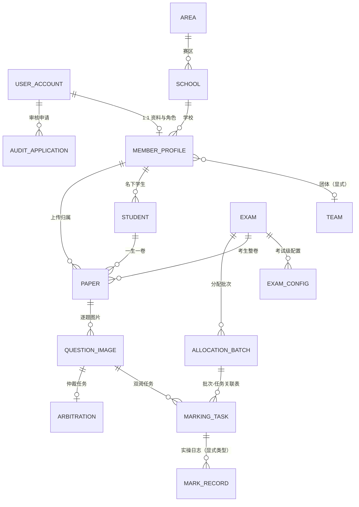

# 新系统设计（CPHOS Platform）

> 版本 v0.3 · 状态：设计草案（决策点见 §10，未定前不冻结）
> 配套文档：《01_旧平台结构与业务调研报告》（归档参考，**不导入数据**）。
> 数据库 schema 以 `apps/api/prisma/schema.prisma` 为准，使用 `prisma db push` 同步；**不保留迁移历史**（新系统未上线前快速迭代，生产化时再评估冻结基线）。

---

## 1. 背景与决策记录

| 决策 | 内容 | 影响 |
| --- | --- | --- |
| D1 | **完全放弃兼容性迁移，重新设计一套系统；不导入任何历史数据** | 字典由管理员按新系统重新录入，新库不保留旧字段语义 |
| D2 | **微信验证无法实现**（无小程序授权/凭据），**旧端不可修改** | 登录标识从 openid 改为**邮箱**；`LegacyMemberRef` 认领仅保留可选兼容能力 |
| D3 | 登录定案：**邮箱注册 + 提交审核资料 + 管理员人工审核** | 认证（邮箱验证）与授权（人工审核）分离 |
| D4 | 数据库：**PostgreSQL** | DDL 均按 PG 编写 |
| D5 | 旧平台调研成果 = 设计输入 | 业务规则继承清单见 §8；史山规避清单见 §7 |
| D6 | **schema 用 `prisma db push` 同步，不建迁移历史** | 新系统未上线前快速迭代；E2E 固定可丢弃内嵌库，生产化时再评估冻结基线 |

## 2. 设计目标与原则

1. **认证与授权分离**：邮箱验证只证明"拥有邮箱"，人工审核才授予平台身份与角色；
2. **全程可审计**：注册、审核、认领绑定、分配、撤销均有日志，可回放；
3. **状态机替代删行**：任务/申请/考试用状态流转 + 软删除，禁止物理删行丢历史；
4. **显式关系**：外键、唯一约束、关联表；杜绝逗号串与多态引用；
5. **考试级配置**：题数/分值/阈值/标题映射按考试版本化，不搞全局单例；
6. **术语统一**：槽位（slot，上传/阅卷单元）与题号/页号分层定义，避免旧系统"subject 三义"。

## 3. 业务范围与 MVP 里程碑

### 3.1 范围

1. **用户域**：邮箱注册 → 提交审核资料 → 管理员人工审核（含老用户认领）→ 角色（负责人/附属教练/仲裁成员）与团体；
2. **考试域**：批次与配置 → 学生建档 → 答题卡上传（逐题图）→ 双阅任务分配（精确均衡替代随机摇匀）→ 阅卷 → 仲裁 → 成绩汇总与排名；
3. **管理域**：字典维护、审核工作台（含认领匹配界面）、审计日志。

### 3.2 里程碑建议

- **M1 用户域 + 审核工作台**：注册/验证码/资料提交/人工审核/认领绑定（对下一场考试是硬前置）；
- **M2 考试域核心**：批次配置、学生、上传、分配、阅卷、仲裁、成绩；
- **M3 收尾**：排名展示、导出、字典与审计界面完善。

排期取决于下一场考试日期（§10 Q6）。

## 4. 数据边界（不导入历史数据）

| 对象 | 处理 | 说明 |
| --- | --- | --- |
| 旧库全部数据 | **不导入** | 历史留存旧库；新系统从零开始，首次字典由管理员在后台维护 |
| area/school/grade/prize/topic | **新建** | 使用数据库自增 ID + 名称唯一约束；保留"个人"等特殊条目时可手动创建 |
| 老用户认领 | **可选兼容** | `LegacyMemberRef` 表保留为能力位，但不主动导入；无数据时认领候选为空、不影响新用户审核 |
| 业务规则（《01》§6） | 作为实现约束（§8） | 双阅/仲裁阈值/最终分公式/均衡目标等仍然继承 |

## 5. 认证与用户模块（定案流程）

### 5.0 账号层级（决定界面入口与权限边界）

| 层级 | 创建方式 | 账号形态 | 说明 |
| --- | --- | --- | --- |
| SUPER_ADMIN 超级管理员 | **系统初始化**脚本创建 | 用户名+显示名+密码 | **全局唯一**，受保护（`protected=true`）：不可删除/禁用/降级 |
| ADMIN 管理员 | 超级管理员将 CPHOS 内部用户**提升**（可降级回 CPHOS_MEMBER） | 用户名+显示名+密码 | 管理后台权限 |
| CPHOS_MEMBER 内部员工 | 管理员**直接建档** | 用户名+显示名+密码 | **完全不依赖邮箱**；仲裁作为**功能模块**对其开放，不再是身份 |
| PLATFORM_USER 普通用户 | 用户**邮箱+验证码自助注册** | 邮箱+密码 | 教练/个人参赛者，注册后待人工审核 |

- **登录：全员统一账密**；账号输入框按内容分流（含 @ → 邮箱；否则 → 用户名，均小写匹配）。
- **邮箱验证码只用于**：① 普通用户注册验证；② 后续**敏感操作**（修改密码、换绑邮箱）二次确认——不发验证码的日常登录。
- **仲裁=功能模块**：业务角色枚举仅 LEADER（负责人）/ COACH（附属教练）；仲裁任务模块由账号层级（CPHOS_MEMBER 及以上）访问，与业务角色解耦。

### 5.1 用户流程（普通用户）

```text
邮箱注册（验证码验证邮箱所有权；登录方式定案后同时设密码）
  → 提交审核资料
      必填：真实姓名、学校（字典下拉）、原微信昵称（老用户认领匹配键）、联系方式
      选填：教师证/工作证明/学生证等图片（1–3 张）
  → 管理员后台审核
      - 老用户认领：比对 ref.legacy_member（姓名+学校+微信昵称+头像），展示候选列表人工点选
        · 唯一命中且资料吻合 → 一键绑定（user_account.legacy_member_id，唯一约束防重复认领）
        · 快照 audit_status=1 的老用户 → 快速通道（资料一致即一键通过）
        · 快照 audit_status=0 的老用户 → 按新用户正常审核（资料即首次建档）
      - 通过 → 写入姓名/学校/默认槽位/上传上限，状态=已通过
      - 驳回 → 备注原因，可修改资料重新提交
  → 角色：默认"负责人"；附属教练/仲裁成员由管理员调整（沿用旧平台约定）
```

### 5.2 资料分级与反冒充

- 必填项低门槛；存疑个案（资料对不上/无候选/重名）由管理员要求补传证明材料；
- 绑定单向一次性：`user_account.legacy_member_id` UNIQUE；全程 `audit_log` 留痕（谁、何时、绑定到哪个旧 id）；
- 联系方式（手机号）作二次确认渠道（高风险个案人工核验）。

### 5.3 登录方式（待定，推荐组合）

| 方式 | 结论 |
| --- | --- |
| 邮箱 + 密码 | **主推**（注册时设置；教练群体为成年人/教师，习惯密码） |
| 验证码登录（OTP） | 可选免密入口 |
| 魔法链接 | 可选，不做主登录 |
| 短信兜底 | 观察项（资质/成本待议） |

### 5.4 验证码技术

6 位数字、TTL 10 分钟、5 次尝试、重发 ≥60s；每邮箱每日 ≤10、每 IP 每小时 ≤10；只存哈希（`sha256(email||code||salt)`）、恒定时间比较、一次性作废。表结构见 `platform.email_code`。

### 5.5 邮件投递（中国网络环境）

自有域名 + 阿里云 DirectMail / 腾讯云 SES / SendCloud；SPF/DKIM/DMARC；域名预热；正文短、纯文本、避免营销词；收件方 QQ/163/126/Gmail/学校邮箱为主。千级用户规模，重点在送达率。

### 5.6 邮箱规范化

trim + 域名小写后入库，唯一约束基于规范化值；注意 Gmail 点号/加号别名（按规范化去重即可）。

### 5.7 批次节奏

| 批次 | 对象 | 说明 |
| --- | --- | --- |
| P0 | 第30届相关人员（87 上传负责人 + 57 阅卷人 + 18 仲裁成员，去重约百人） | 下一场考试的最小可用集，最先运营 |
| P1 | 其余已审核老用户（约 1100+） | 按学校/赛区分批通知，快速通道 |
| P2 | 待审核老用户（1788） | 不主动运营，随自然注册进入流程 |

## 6. 实体模型草案（ER）



关键决策点（草案立场，待拍板）：

- **用户与成员分离**：`user_account`（登录/邮箱/密码/状态/legacy_member_id）与 `member_profile`（姓名/学校/角色/团体/槽位/上限）分离；
- **团队显式化**：`TEAM` 表（负责人 + 成员 + 共享上传限额）；个人参赛者=单人团队；
- **分配关联表**：`allocation_item(batch_id, slot, member_id)` 替代旧逗号串；
- **实操日志显式类型**：`mark_record(task_type: marking|arbitration, task_id, operator_id)`；
- **配置考试级**：`exam_config`（题数/分值/阈值/标题映射）每场一份。

## 7. 史山 → 新设计改进清单

| # | 旧系统问题（《01》§8.2） | 新系统设计 |
| --- | --- | --- |
| 1 | 逗号串存分配结果 | 分配批次 + 关联表 |
| 2 | 撤销=物理删行 | 状态机 + 软删除/归档，全程可审计 |
| 3 | record.topic_id 多态引用 | 显式 `task_type` 列 |
| 4 | member.school_id varchar | 外键 bigint |
| 5 | 无外键/唯一约束 | 外键 + 唯一 + 检查约束 |
| 6 | set 全局单例 | 考试级配置表 |
| 7 | prize 字符串、字典虚设 | 字典外键/枚举 |
| 8 | 分数 float、时间 int(10) | numeric / timestamptz |
| 9 | 注释与实现漂移 | 枚举类型/注释随代码评审 |
| 10 | 双阅无轮次字段 | 显式 `round_no`（第1阅/第2阅） |
| 11 | 团队自指（含 2 行自指脏数据） | 显式 TEAM 表 |
| 12 | 审核与登录耦合 | 认证（邮箱）与授权（人工审核）分离 |
| 13 | 无审计日志、无 updated_at | 统一审计表 + updated_at |
| 14 | 槽位/题号/页号语义漂移 | 三层术语定义（slot/question/page） |

## 8. 业务规则继承清单（旧平台实测约束，新实现必须满足）

1. **双阅**：每题 2 个阅卷任务；分差**严格大于** `gap` → 仲裁任务；最终分 = 单阅取单分 / 双阅取均值 / 有仲裁取仲裁分（第30届实测命中 4/4、2253/2261、233/239）；
2. **上传**：一场考试一名学生一套卷；8 理论槽位 + 可选实验槽位（9/10）；上传限额团队共享（旧默认 100、个人 1）；
3. **分配均衡**：每人只批一个槽位；以"各槽位上传卷数之和"为负载指标做**精确均衡**（线性规划/贪心），替代随机摇匀；个人参赛者任务由阅卷团队吸收；
4. **审核**：审核字段集 = 姓名/学校/默认槽位/上传上限；通过默认"负责人"；角色切换前检查未完成任务（旧 API 行为）；
5. **排名**：理论/实验/总分分段展示（"1/10/20/30/40/50"模式）；
6. **实验题**：CPHOS 成员经槽位 9/10 承担实验题阅卷，与上传量无关（仲裁/实验题按功能模块组织，不再依赖"仲裁成员"身份）。

## 9. 数据层交付物（已随实现更新）

| 文件 | 内容 | 状态 |
| --- | --- | --- |
| `apps/api/prisma/schema.prisma` | 新系统核心模型：UserAccount / EmailCode / RefreshToken / AuditApplication / AuditMaterial / AuditLog / MemberProfile / Team / 字典（Area/School/Grade/Prize/Topic）/ LegacyMemberRef（可选兼容） | 生效（`prisma db push` 同步） |
| `scripts/`（api） | `dev-db.mjs` 内嵌 PG 开发库；`seed-dev.ts` 合成字典；`seed-e2e.ts` E2E 数据；管理员引导与冒烟脚本 | 生效 |
| `e2e/` | Playwright 本地 E2E（复用本机 Edge，无 GitHub CI） | 生效 |

> **数据库策略**：按用户明确决策，**不使用 Prisma 迁移历史**，schema 变更直接 `prisma db push`；E2E 固定连接可丢弃的内嵌库 `127.0.0.1:54329/cphos`，seed 脚本会拒绝疑似共享/生产库。不导入历史数据的策略见 D1/D6 与 §4。

## 10. 开放决策点（需逐项拍板）

| # | 问题 | 建议 |
| --- | --- | --- |
| Q1 | 外包用户库连接信息与结构 | **已关闭**：不导入历史数据，不做外部库对接 |
| Q2 | 对象存储（审核材料/答题卡） | 待定（考试域前决策） |
| Q3 | 团队模型：显式 TEAM vs 负责人自引用 | **已定并实现**：显式 Team（负责人 + 成员 + 共享上传限额） |
| Q4 | 登录方式：邮箱+密码 ± 免密入口；短信兜底 | 密码为主推 |
| Q5 | 审核资料强度：分级 vs 全员强制证明 | 分级（§5.2） |
| Q6 | MVP 时间表（下一场考试日期） | 决定排期 |
| Q7 | 认领后角色继承 | **已关闭**：不导入历史数据；认领仅保留可选兼容，默认按新用户审核 |
| Q8 | 参照快照存放 | **已关闭**：`LegacyMemberRef` 保留能力位，不主动导入 |
| Q9 | 旧端并行策略：冻结 vs 双轨 | 待定（不影响新系统开发） |
| Q10 | 发信域名与服务商 | 需采购/备案决策 |

## 11. 建议的先行实验

1. 送达率矩阵测试（QQ/163/126/Gmail/学校邮箱/企业邮箱 × 候选服务商）；
2. 验证码全链路自测（注册→审核→登录→找回→改密→换绑邮箱，含频控/过期路径；已由 E2E 覆盖主干）；
3. 团队共享限额与考试上传扣减联测（考试域实现后）；
4. 分配均衡算法压测（考试域实现后）。

## 12. 仓库布局（已实施）

```
CPHOS_Platform/
├── docs/            # 01 旧系统调研 · 02 新系统设计（本文档）· README
├── apps/
│   ├── api/         # Fastify + Prisma（PostgreSQL）：src/ 路由/插件/模块，prisma/schema.prisma + prisma/migrations，scripts/ 工具
│   └── web/         # Vite + React + Ant Design：三端界面（/app 平台用户、/cphos CPHOS 成员、/admin 管理员）
├── packages/
│   └── shared/      # 前后端共用：枚举、Zod 校验 schema、DTO 类型
├── e2e/             # Playwright 本地 E2E（复用 Edge，不接 CI）
├── pnpm-workspace.yaml / tsconfig.base.json / .npmrc（代理 7892）
└── README.md        # 快速开始
```

## 13. 技术栈决策（已定）

| 层 | 选型 | 理由 |
| --- | --- | --- |
| 语言/工程 | TypeScript 全栈，pnpm workspace monorepo | 类型贯穿前后端；共享包保证 API 契约一致 |
| 后端 | Fastify 5 + Prisma 6（PostgreSQL 16） | Fastify 轻量高性能、插件生态成熟；Prisma 类型安全，schema 用 migrate 维护可审计迁移 |
| 校验 | Zod（共享包） | 前后端同一套 schema |
| 认证 | @node-rs/argon2 + @fastify/jwt + DB 刷新令牌轮换 + @fastify/rate-limit + nodemailer | 均为成熟库；不造轮子 |
| 前端 | React 18 + Vite 6 + Ant Design 5 + React Router 6 + TanStack Query 5 + Zustand 5 + axios | antd 中文生态成熟（表格/表单/后台强项）；Query 管服务端状态 |
| 开发数据库 | embedded-postgres（PG16 内嵌，零安装） | 本机无 Docker/PostgreSQL；生产用正式 PG 实例（DATABASE_URL 覆盖） |
